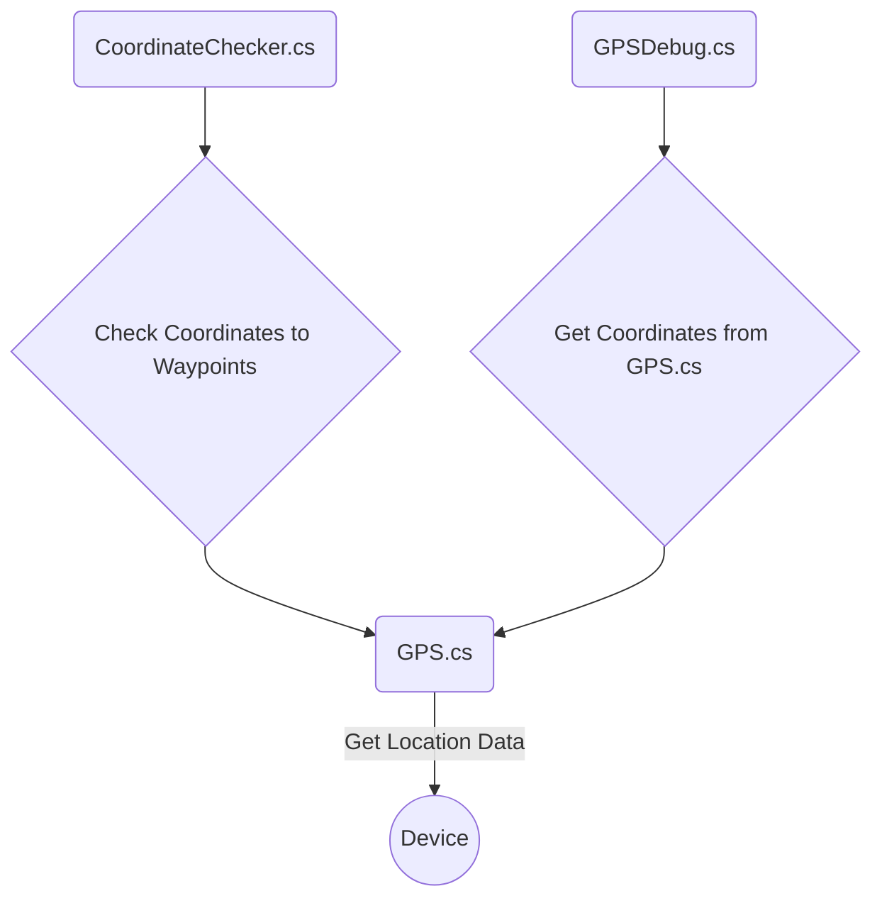
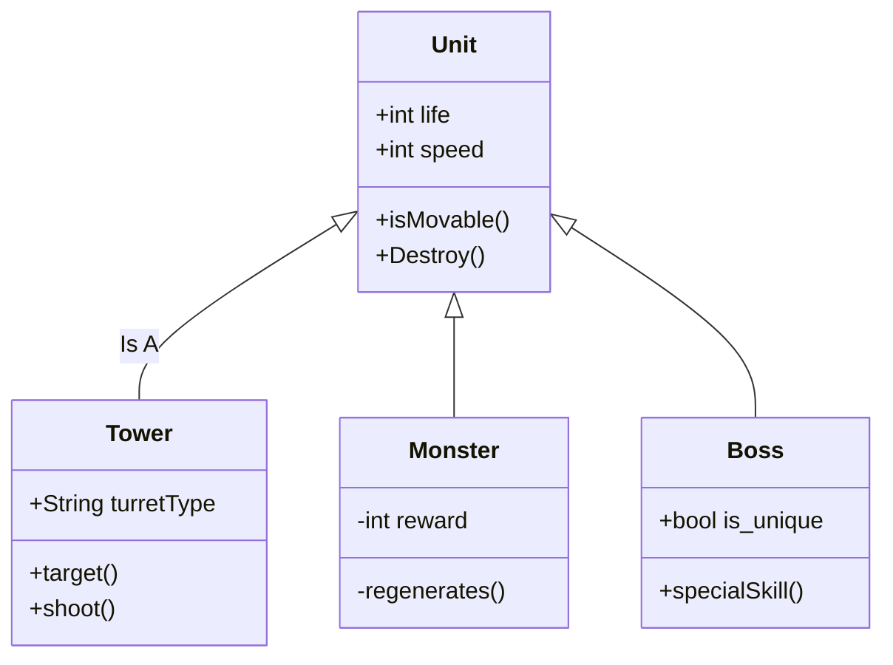

# Veluwe Verkenner

Veluwe Verkenner is een proove of concept voor ons proef examen.

voor een uitgebreidere documentatie van dit project kun je terecht bij onze wiki: [wiki](https://github.com/erwinhenraat/VoorbeeldExamenRepo/wiki)

# Geproduceerde Game Onderdelen

Bob Hoogenboom:
  * [GPS System](https://github.com/DiegoR03/ProefProeveVeluwe/tree/main/ProefProeveVeluwe/Assets/Scripts/Runtime/GPS)


Robin Knol:
  * [Mini Games](https://github.com/DiegoR03/ProefProeveVeluwe/tree/main/ProefProeveVeluwe/Assets/Scripts/Runtime/Animal%20Interaction)

Diego Ramon:
  * [WaypointData](https://github.com/DiegoR03/ProefProeveVeluwe/tree/main/ProefProeveVeluwe/Assets/Scripts/Runtime/Data)
  * [UI](https://github.com/DiegoR03/ProefProeveVeluwe/tree/main/ProefProeveVeluwe/Assets/Scripts/Runtime/UI)


## GPS System

De GPS System is de core van de game. De speler moet weten waar hij/zij naartoe loopt door middel van de locatie input gegeven van je device.


### flowchart for the GPS-System:



### class diagram voor game entities:




## GPS-System door Bob Hoogenboom

Het basis GPS script pakt data van de device. Deze data sla ik express op in 1 script vanwege performance. ik wil niet dat alle 3 de scripts dit iedere frame 3 keer opvragen van de device, aangezien we ook zagen dat GPS veel batterij trekt. Nadat de GPS class je huidige GPS data vasthoud en vrij is om opgevraagd te worden door andere scripts. 
Een van die andere scripts is het CoordinateChecker script. dit script vraagt de GPS data op van het basis GPS script en rekent uit met de formule van Haversine of jou GPS data overeen komt met de uitkomst van de formule. Zo ja dan kan je een minigame spelen, zo niet dan moet je nog even verder lopen ;).


<p float="left">
  
  
 </p>


## Mini game door Robin Knol

De mini games is het leuke gedeelte van het spel. Waarneer de speler in de buurt komt van een dier kan hij/zij een mini game doen. Hier in kan je met het dier spelen.

## Waypoints Data door Diego Ramon

De waypoints systeem is één van de belangrijkste punten in de game, op deze manier kan de speler namelijk de mini-games spelen en weten waar hij/zij naartoe moet.
<br/>
De eerste script ```GPSWayPointData``` gebruikt drie verschillende data's die wij gebruiken om scriptable objects aan te maken. Op deze manier kunnen wij makkelijk en snel nieuwe waypoints toevoegen zonder wij allemaal losse scripts gebruiken binnen Unity. Binnen deze scriptable object kunnen wij de drie eerder genoemde data's aanpassen naar onze gewilde locatie, deze data wordt in de volgende drie values verdeelt; `WaypointName`, `LongitudeValue` en `LatitudeValue`

<br/>

Nadat wij al deze waypoints hebben aangemaakt stoppen wij al deze scriptable object in een lijst, dit wordt gedaan in de ```GPSRoutes``` script. Deze script vraagt alle scriptable object naar keuze aan en voegt ze samen tot één route die de speler dan kan volgen.


